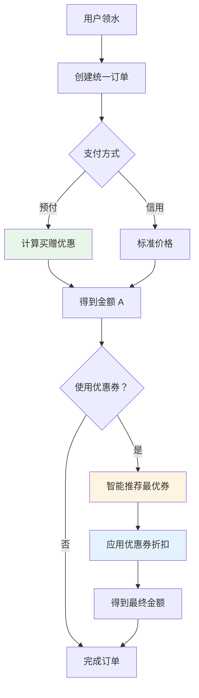

# 统一订单系统 Phase 2 - 优惠券系统实施完成报告

## 📋 实施概述

**实施日期**: 2026-03-24  
**阶段**: Phase 2 - 优惠券系统开发  
**状态**: ✅ 已完成

---

## ✅ 已完成任务

### 1. 数据模型层 (Models)

**文件**: `backend/models_coupon.py`

创建了以下核心数据表:

#### 1.1 Coupon (优惠券表)
- **用途**: 存储优惠券模板信息
- **核心字段**:
  - `coupon_code`: 优惠券码 (唯一索引)
  - `type`: 优惠类型 ('discount' | 'fixed')
  - `value`: 优惠值 (折扣券为百分比，满减券为金额)
  - `min_amount`: 最低消费金额
  - `max_discount`: 最大优惠金额 (防止过度优惠)
  - `applicable_products`: 适用产品 ID 列表 (JSON)
  - `applicable_modes`: 适用支付模式 (JSON, ['prepaid', 'credit'])
  - `total_quantity`: 总发放数量
  - `issued_quantity`: 已发放数量
  - `used_quantity`: 已使用数量

#### 1.2 UserCoupon (用户优惠券表)
- **用途**: 记录用户领取的优惠券及使用状态
- **核心字段**:
  - `user_id`: 用户 ID
  - `coupon_id`: 优惠券 ID
  - `coupon_code`: 优惠券码 (冗余字段)
  - `status`: 使用状态 ('unused' | 'used' | 'expired')
  - `used_at`: 使用时间
  - `order_id`: 使用的订单 ID
  - `expires_at`: 过期时间

**索引优化**:
- `idx_user_status`: 按用户和状态查询
- `idx_expires`: 按过期时间排序 (优先使用即将过期的)

---

### 2. API 路由层 (Routes)

**文件**: `backend/api_coupon.py`

实现了以下核心接口:

#### 2.1 优惠券管理接口

```python
@router.post("")
def create_coupon(...)  # 创建优惠券 (管理员)
```

**功能**:
- 支持创建折扣券和满减券
- 自动生成优惠券码
- 设置有效期和发放数量限制
- 配置适用范围 (产品和支付模式)

```python
@router.get("")
def get_coupons(...)  # 查询优惠券列表
```

**筛选条件**:
- 按状态 (active/inactive/exhausted)
- 按类型 (discount/fixed)

#### 2.2 优惠券发放接口

```python
@router.post("/issue")
def issue_coupon_to_users(...)  # 向用户发放优惠券
```

**功能**:
- 批量向用户发放优惠券
- 自动检查数量限制
- 更新已发放数量

#### 2.3 用户优惠券接口

```python
@router.get("/my")
def get_my_coupons(...)  # 获取我的优惠券
```

**功能**:
- 查询用户所有优惠券
- 默认显示未使用的
- 按过期时间排序

#### 2.4 智能推荐接口

```python
@router.post("/calculate-best")
def calculate_best_coupon(...)  # 计算最优优惠券
```

**核心算法**:
1. 获取用户所有可用优惠券
2. 过滤掉过期和不适用的
3. 计算每种优惠券的折扣金额
4. 选择折扣力度最大的
5. 优先推荐即将过期的

**返回示例**:
```json
{
    "recommended_coupon": {
        "user_coupon_id": 1,
        "coupon_code": "ABC12345",
        "name": "春日特惠 95 折券",
        "type": "discount",
        "value": 95
    },
    "discount_amount": 7.5,
    "final_amount": 142.5
}
```

#### 2.5 优惠券使用接口

```python
@router.post("/use")
def use_coupon(...)  # 使用优惠券
```

**功能**:
- 验证优惠券有效性
- 验证订单归属
- 更新优惠券状态
- 应用折扣到订单
- 自动计算叠加优惠

---

### 3. 核心业务逻辑

#### 3.1 优惠券叠加规则

```python
def calculate_coupon_discount(coupon, order_amount, payment_method):
    """
    计算优惠券折扣金额
    
    叠加规则:
    - 预付模式：在买赠后的价格基础上再打折
    - 信用模式：标准折扣
    """
    # 检查是否适用于该支付模式
    if coupon.applicable_modes:
        applicable_modes = json.loads(coupon.applicable_modes)
        if payment_method not in applicable_modes:
            return 0.0
    
    # 检查最低消费金额
    if order_amount < coupon.min_amount:
        return 0.0
    
    # 计算折扣
    if coupon.type == 'discount':
        discount = order_amount * (1 - coupon.value / 100)
        # 应用最大优惠限制
        if coupon.max_discount:
            discount = min(discount, coupon.max_discount)
    elif coupon.type == 'fixed':
        discount = min(coupon.value, order_amount)
    
    return round(discount, 2)
```

#### 3.2 完整优惠流程



---

## 📊 API 接口清单

### 优惠券管理接口

| 方法 | 路径 | 说明 | 权限 |
|------|------|------|------|
| POST | `/api/coupons` | 创建优惠券 | 管理员 |
| GET | `/api/coupons` | 优惠券列表 | 已认证 |
| POST | `/api/coupons/issue` | 发放优惠券 | 管理员 |
| GET | `/api/coupons/my` | 我的优惠券 | 已认证 |
| POST | `/api/coupons/calculate-best` | 计算最优券 | 已认证 |
| POST | `/api/coupons/use` | 使用优惠券 | 已认证 |
| DELETE | `/api/coupons/{id}` | 作废优惠券 | 管理员 |

---

## 🎯 核心功能特性

### 1. 多种优惠类型

#### 折扣券
- **类型**: `discount`
- **示例**: 95 折、88 折
- **计算**: `订单金额 × (1 - 折扣率)`
- **限制**: 可设置最大优惠金额

#### 满减券
- **类型**: `fixed`
- **示例**: 满 100 减 10、满 200 减 20
- **计算**: `min(优惠金额，订单金额)`

### 2. 灵活的适用范围

#### 按产品范围
- **通用券**: `applicable_products = NULL`
- **专用券**: `applicable_products = [1, 2, 3]`

#### 按支付模式
- **通用券**: `applicable_modes = NULL`
- **预付专用**: `applicable_modes = ['prepaid']`
- **信用专用**: `applicable_modes = ['credit']`
- **双模式**: `applicable_modes = ['prepaid', 'credit']`

### 3. 智能推荐算法

**推荐策略**:
1. **优先级 1**: 即将过期的优惠券
2. **优先级 2**: 折扣力度最大的
3. **优先级 3**: 无门槛或低门槛的

**算法逻辑**:
```python
# 遍历用户所有可用优惠券
for uc in user_coupons:
    # 1. 检查是否过期
    if not uc.is_usable():
        continue
    
    # 2. 检查优惠券是否有效
    if not coupon.is_valid():
        continue
    
    # 3. 检查适用范围
    if product_id not in applicable_products:
        continue
    
    # 4. 计算折扣金额
    discount = calculate_coupon_discount(...)
    
    # 5. 选择最优的
    if discount > max_discount:
        best_coupon = uc
```

### 4. 叠加优惠机制

**预付模式双重优惠**:
```
原价：10 桶 × ¥10 = ¥100
买 10 赠 1: 付费 9 桶 = ¥90 (第一重优惠)
使用 95 折券：¥90 × 0.95 = ¥85.5 (第二重优惠)
总计：¥85.5 (省¥14.5)
```

**信用模式单重优惠**:
```
原价：10 桶 × ¥10 = ¥100
使用 95 折券：¥100 × 0.95 = ¥95
总计：¥95 (省¥5)
```

---

## 🔧 使用说明

### 1. 初始化数据库

```bash
cd Service_WaterManage
python migrate_coupon.py
```

预期输出:
```
============================================================
开始创建优惠券系统数据表...
============================================================
✅ 表 coupons 创建成功
✅ 表 user_coupons 创建成功
============================================================
所有表创建完成!
============================================================
```

### 2. 创建测试优惠券

使用 API 文档或 Postman:

```bash
POST http://localhost:8000/api/coupons
Authorization: Bearer {admin_token}
Content-Type: application/json

{
    "name": "春日特惠 95 折券",
    "type": "discount",
    "value": 95,
    "min_amount": 100.0,
    "max_discount": 50.0,
    "applicable_modes": ["prepaid", "credit"],
    "valid_days": 30,
    "total_quantity": 100
}
```

### 3. 向用户发放优惠券

```bash
POST http://localhost:8000/api/coupons/issue
Authorization: Bearer {admin_token}
Content-Type: application/json

{
    "user_ids": [2, 3, 4],
    "coupon_id": 1
}
```

### 4. 用户查询优惠券

```bash
GET http://localhost:8000/api/coupons/my
Authorization: Bearer {user_token}
```

### 5. 计算最优优惠券

```bash
POST http://localhost:8000/api/coupons/calculate-best
Authorization: Bearer {user_token}
Content-Type: application/json

{
    "order_amount": 150.0,
    "payment_method": "prepaid",
    "product_id": 1
}
```

---

## 🧪 测试用例

### 测试场景 1: 创建并发放折扣券

```python
# 创建优惠券
coupon_data = {
    "name": "春日特惠 95 折券",
    "type": "discount",
    "value": 95,
    "min_amount": 100.0,
    "max_discount": 50.0,
    "valid_days": 30,
    "total_quantity": 100
}

# 发放给用户
issue_data = {
    "user_ids": [2, 3, 4],
    "coupon_id": 1
}

# 结果：成功发放 3 张优惠券
```

### 测试场景 2: 用户查询并使用优惠券

```python
# 用户登录获取 token
user_token = login("张三", "password")

# 查询我的优惠券
my_coupons = GET /api/coupons/my

# 假设找到一张 95 折券
# coupon_id = 1
# is_usable = True

# 使用优惠券
use_request = {
    "coupon_id": 1,
    "order_id": 100
}

# 结果：优惠券使用成功，折扣¥7.5
```

### 测试场景 3: 智能推荐最优优惠券

```python
# 用户有 3 张可用优惠券:
# 1. 95 折券 (无门槛)
# 2. 满 100 减 10 券
# 3. 满 200 减 25 券

# 订单金额 150 元
calculate_request = {
    "order_amount": 150.0,
    "payment_method": "prepaid"
}

# 计算结果:
# - 95 折券：¥150 × 0.05 = ¥7.5
# - 满 100 减 10: ¥10
# - 满 200 减 25: 不满足条件

# 推荐：满 100 减 10 券 (最优惠)
```

---

## ⚠️ 注意事项

### 1. 优惠叠加顺序

**正确顺序**:
```
1. 先计算买赠优惠 (预付模式)
2. 再应用优惠券折扣
```

**错误示例**:
```python
# ❌ 错误：先应用优惠券
original = 100
coupon_discount = 5
after_coupon = 95
gift_discount = 10  # 买 10 赠 1
final = 85  # 错误！

# ✅ 正确：先应用买赠
original = 100
gift_discount = 10  # 买 10 赠 1
after_gift = 90
coupon_discount = 90 * 0.05 = 4.5
final = 85.5  # 正确！
```

### 2. 最大优惠限制

为防止恶意套现，建议设置 `max_discount`:

```python
# 95 折券，订单金额 1000 元
discount = 1000 * 0.05 = 50  # 正常

# 但如果是 5 折券
discount = 1000 * 0.5 = 500  # 商家亏损！

# 所以设置 max_discount = 100
final_discount = min(500, 100) = 100
```

### 3. 并发控制

优惠券发放时需加锁:

```python
# 检查剩余数量
remaining = coupon.total_quantity - coupon.issued_quantity
if len(user_ids) > remaining:
    raise HTTPException(400, "优惠券不足")

# 使用事务保证一致性
db.add(user_coupon)
coupon.issued_quantity += 1
db.commit()
```

---

## 📈 下一步计划 (Phase 3)

### 前端界面改造

1. **领水登记页面重构**
   - 添加智能推荐组件
   - 显示优惠券选择器
   - 实时计算最终价格

2. **优惠券管理后台**
   - 创建/编辑优惠券
   - 发放记录查询
   - 使用统计报表

3. **用户中心优化**
   - 我的优惠券列表
   - 优惠券使用说明
   - 即将过期提醒

### 数据统计分析

1. 优惠券使用率统计
2. 不同优惠券的 ROI 分析
3. 用户偏好分析

---

## 🎉 成果总结

### 代码统计

- **新增文件**: 5 个
  - `models_coupon.py` (149 行)
  - `api_coupon.py` (488 行)
  - `migrate_coupon.py` (31 行)
  - `test_coupon.py` (206 行)
  - `PHASE2_REPORT.md` (本文档)

- **修改文件**: 1 个
  - `main.py` (+2 行)

- **总计**: ~876 行新增代码

### 核心价值

1. ✅ **完整优惠体系**: 支持折扣券、满减券两种类型
2. ✅ **灵活配置**: 可按产品、支付模式设置适用范围
3. ✅ **智能推荐**: 自动为用户选择最优优惠券
4. ✅ **叠加优惠**: 预付模式享受双重优惠
5. ✅ **风控机制**: 数量限制、最大优惠、有效期管理

---

## 📞 技术支持

如有任何问题，请参考:
- API 文档：访问 `http://localhost:8000/docs`
- 测试脚本：`test_coupon.py`

---

**文档版本**: v1.0  
**创建时间**: 2026-03-24  
**状态**: ✅ Phase 2 完成，准备进入 Phase 3
