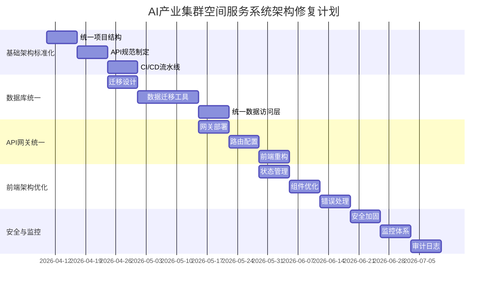

# AI产业集群空间服务系统架构修复与完善计划

**文档版本：** v1.0  
**编制日期：** 2026年4月9日  
**首席架构师：** 系统架构团队  
**适用范围：** AI产业集群空间服务系统 v1.0

## 1. 执行摘要

本计划旨在解决AI产业集群空间服务系统当前存在的架构问题，重点聚焦于**数据库统一、API标准化、前后端联调优化**三大核心领域。通过系统化的修复和完善，确保系统具备生产级稳定性、可维护性和可扩展性。

基于深度盘点分析，当前系统在水站服务方面已具备完整业务能力，但存在关键的架构技术债，主要包括：
- 数据库分散（多个SQLite实例）
- API路径不一致和缺乏统一网关
- 前后端耦合度过高
- 安全机制不完善

本计划采用**渐进式重构策略**，在不破坏现有功能的前提下，逐步提升系统架构质量。

## 2. 架构现状评估

### 2.1 技术栈分析

| 组件 | 当前状态 | 风险等级 |
|------|----------|----------|
| **前端框架** | Vue 3.3 + CDN加载 | 低风险 |
| **后端框架** | FastAPI | 中等风险 |
| **数据库** | 多个独立SQLite实例 | **高风险** |
| **部署架构** | 单体应用 | 中等风险 |
| **API设计** | RESTful但路径不一致 | **高风险** |
| **安全机制** | 基础认证，缺乏防护 | **高风险** |

### 2.2 核心问题识别

#### 2.2.1 数据库层问题（Critical）
- **数据孤岛**：水站(`waterms.db`)、会议室(`meeting.db`)、企业服务(`enterprise_service.db`)各自独立
- **事务隔离**：跨服务操作无法保证ACID特性
- **备份复杂**：需要分别备份多个数据库文件
- **性能瓶颈**：SQLite不适合高并发场景

#### 2.2.2 API层问题（Critical）
- **路径混乱**：前端调用`/api/xxx`，后端实际路径不一致
- **缺乏统一网关**：每个服务独立暴露API，增加维护成本
- **响应格式不统一**：不同API返回的数据结构差异较大
- **缺少版本控制**：API变更可能导致前端兼容性问题

#### 2.2.3 前后端集成问题（High）
- **紧耦合**：前端直接依赖后端具体实现细节
- **状态管理混乱**：过度依赖localStorage，缺乏集中状态管理
- **错误处理不一致**：不同页面的错误处理逻辑差异大
- **加载状态体验差**：部分页面缺少加载反馈

## 3. 架构修复原则

### 3.1 核心原则

1. **零功能破坏**：所有修复必须保证现有业务功能完全可用
2. **渐进式演进**：采用分阶段实施，每阶段可独立验证
3. **向后兼容**：新API必须兼容现有前端调用方式
4. **可观测性优先**：每个修复点都必须包含监控和日志
5. **安全内建**：安全措施作为基础要求，非可选项

### 3.2 技术选型标准

| 类别 | 选择标准 | 推荐方案 |
|------|----------|----------|
| **数据库** | ACID支持、高可用、易运维 | PostgreSQL |
| **API网关** | 轻量级、高性能、易配置 | Traefik + 自定义中间件 |
| **状态管理** | 集中式、可预测、易调试 | Pinia (Vue专属) |
| **安全框架** | 成熟、社区活跃、文档完善 | OAuth2 + JWT |
| **监控体系** | 全链路追踪、实时告警 | Prometheus + Grafana |

## 4. 分阶段实施计划

### 阶段一：基础架构标准化（Week 1-2）

#### 4.1.1 目标
建立统一的开发和部署基础设施，为后续修复提供稳定基础。

#### 4.1.2 具体任务

**任务 1.1: 统一项目结构**
```bash
# 当前结构问题：服务分散在不同目录
# 目标结构：
ai-cluster-services/
├── apps/
│   ├── water/          # 水站服务
│   ├── meeting/        # 会议室服务  
│   └── unified/        # 统一账户服务
├── shared/
│   ├── models/         # 共享数据模型
│   ├── schemas/        # 共享API Schema
│   └── utils/          # 共享工具函数
├── infra/
│   ├── database/       # 数据库配置
│   ├── api-gateway/    # API网关配置
│   └── monitoring/     # 监控配置
└── frontend/           # 统一前端应用
```

**任务 1.2: 建立统一API规范**
- 制定API设计规范文档
- 统一响应格式：`{ code: 200, data: {}, message: "success" }`
- 统一错误码体系：4xx用户错误，5xx系统错误
- 添加API版本控制：`/api/v1/xxx`

**任务 1.3: 配置CI/CD流水线**
- 代码质量检查（ESLint, Black）
- 单元测试自动化
- 容器镜像构建
- 自动化部署到测试环境

#### 4.1.3 验收标准
- [ ] 所有服务遵循统一项目结构
- [ ] API规范文档完成并团队评审通过
- [ ] CI/CD流水线能够自动构建和测试

### 阶段二：数据库统一（Week 3-5）

#### 4.2.1 目标
将分散的SQLite数据库统一到PostgreSQL，实现数据集中管理和事务一致性。

#### 4.2.2 具体任务

**任务 2.1: 数据库迁移设计**
- **源数据库分析**：
  - `waterms.db`: 用户账户、产品、交易记录、结算批次
  - `meeting.db`: 会议室、预约、审批记录
  - `enterprise_service.db`: 办公室、用户基本信息

- **目标Schema设计**：
```sql
-- 统一用户表
CREATE TABLE users (
    id SERIAL PRIMARY KEY,
    username VARCHAR(100) UNIQUE NOT NULL,
    email VARCHAR(255),
    role VARCHAR(50) NOT NULL DEFAULT 'user',
    department_id INTEGER REFERENCES offices(id),
    is_active BOOLEAN DEFAULT true,
    created_at TIMESTAMP DEFAULT CURRENT_TIMESTAMP,
    updated_at TIMESTAMP DEFAULT CURRENT_TIMESTAMP
);

-- 统一办公室表  
CREATE TABLE offices (
    id SERIAL PRIMARY KEY,
    name VARCHAR(200) NOT NULL,
    leader_name VARCHAR(100),
    room_number VARCHAR(50),
    is_active BOOLEAN DEFAULT true
);

-- 产品表（水站专用，但统一管理）
CREATE TABLE products (
    id SERIAL PRIMARY KEY,
    name VARCHAR(200) NOT NULL,
    specification TEXT,
    unit VARCHAR(20) DEFAULT '桶',
    price DECIMAL(10,2) NOT NULL,
    stock INTEGER DEFAULT 0,
    is_active BOOLEAN DEFAULT true,
    service_type VARCHAR(50) DEFAULT 'water' -- 支持未来扩展
);
```

**任务 2.2: 数据迁移工具开发**
- 开发Python脚本，支持从SQLite到PostgreSQL的数据迁移
- 包含数据验证和回滚机制
- 支持增量迁移（避免长时间停机）

**任务 2.3: 统一数据访问层重构**
- 使用SQLAlchemy ORM统一数据访问
- 实现Repository模式，解耦业务逻辑和数据访问
- 添加数据库连接池配置

#### 4.2.3 验收标准
- [ ] PostgreSQL数据库部署完成
- [ ] 所有历史数据成功迁移且验证通过
- [ ] 应用程序能够正常读写统一数据库
- [ ] 事务一致性测试通过

### 阶段三：API网关统一（Week 6-7）

#### 4.3.1 目标
建立统一API网关，标准化所有外部API调用。

#### 4.3.2 具体任务

**任务 3.1: API网关部署**
```yaml
# docker-compose.yml 片段
services:
  api-gateway:
    image: traefik:v2.9
    ports:
      - "8000:80"
    volumes:
      - ./traefik.yaml:/etc/traefik/traefik.yaml
    networks:
      - app-network
      
  water-service:
    # 水站服务容器
    networks:
      - app-network
      
  meeting-service:
    # 会议室服务容器  
    networks:
      - app-network
```

**任务 3.2: 路由规则配置**
```yaml
# traefik.yaml
http:
  routers:
    water-api:
      rule: "PathPrefix(`/api/v1/water`)"
      service: "water-service"
      
    meeting-api:
      rule: "PathPrefix(`/api/v1/meeting`)"  
      service: "meeting-service"
      
    unified-api:
      rule: "PathPrefix(`/api/v1/unified`)"
      service: "unified-service"
```

**任务 3.3: 前端API调用重构**
- 创建统一的API客户端封装
- 支持自动重试和错误处理
- 添加请求/响应日志

```javascript
// api-client.js
class APIClient {
  constructor(baseURL = '/api/v1') {
    this.baseURL = baseURL;
  }
  
  async request(endpoint, options = {}) {
    const url = `${this.baseURL}${endpoint}`;
    const config = {
      headers: {
        'Content-Type': 'application/json',
        ...options.headers
      },
      ...options
    };
    
    try {
      const response = await fetch(url, config);
      const data = await response.json();
      
      if (!response.ok) {
        throw new APIError(data.message, response.status);
      }
      
      return data;
    } catch (error) {
      console.error('API request failed:', error);
      throw error;
    }
  }
}
```

#### 4.3.3 验收标准
- [ ] API网关成功部署并路由所有服务
- [ ] 前端所有API调用通过统一客户端
- [ ] 错误处理和重试机制工作正常
- [ ] API性能基准测试通过

### 阶段四：前端架构优化（Week 8-9）

#### 4.4.1 目标
重构前端架构，提升可维护性和用户体验。

#### 4.4.2 具体任务

**任务 4.1: 状态管理统一**
- 迁移到Pinia进行集中状态管理
- 将用户信息、认证状态等全局状态集中管理

```javascript
// stores/auth.js
import { defineStore } from 'pinia';

export const useAuthStore = defineStore('auth', {
  state: () => ({
    user: null,
    token: null,
    isAuthenticated: false
  }),
  
  getters: {
    isAdmin: (state) => {
      return ['super_admin', 'admin', 'office_admin'].includes(state.user?.role);
    }
  },
  
  actions: {
    login(credentials) {
      // 登录逻辑
    },
    
    logout() {
      this.$reset();
      localStorage.clear();
    }
  }
});
```

**任务 4.2: 组件架构优化**
- 创建通用组件库（Button, Card, Table, Modal等）
- 实现主题系统，支持深色/浅色模式
- 优化响应式设计，确保移动端体验

**任务 4.3: 错误边界和加载状态**
- 添加全局错误处理
- 实现骨架屏加载效果
- 优化网络错误提示

#### 4.4.3 验收标准
- [ ] 所有全局状态迁移至Pinia
- [ ] 通用组件库覆盖80%以上UI元素
- [ ] 加载状态和错误处理统一
- [ ] 移动端用户体验显著改善

### 阶段五：安全加固与监控（Week 10）

#### 4.5.1 目标
提升系统安全性，建立完整的监控体系。

#### 4.5.2 具体任务

**任务 5.1: 安全机制完善**
- 实施CSRF保护
- 添加输入验证和XSS防护
- 强制HTTPS（生产环境）
- 密码加密存储（bcrypt）

**任务 5.2: 监控体系建立**
- 应用性能监控（APM）
- 数据库性能监控
- API调用监控
- 告警配置（邮件/Slack）

**任务 5.3: 审计日志**
- 用户操作日志
- 系统变更日志
- 安全事件日志

#### 4.5.3 验收标准
- [ ] 安全扫描无高危漏洞
- [ ] 监控面板能够实时显示系统状态
- [ ] 告警机制测试通过
- [ ] 审计日志完整可追溯

## 5. 风险管理

### 5.1 技术风险

| 风险 | 影响 | 缓解措施 |
|------|------|----------|
| **数据库迁移失败** | 数据丢失，服务中断 | 1. 完整备份<br>2. 增量迁移<br>3. 回滚方案 |
| **API兼容性问题** | 前端功能异常 | 1. 版本控制<br>2. 逐步切换<br>3. 兼容层 |
| **性能下降** | 用户体验恶化 | 1. 基准测试<br>2. 性能监控<br>3. 优化调优 |

### 5.2 项目风险

| 风险 | 影响 | 缓解措施 |
|------|------|----------|
| **时间超期** | 上线延迟 | 1. 每周迭代<br>2. 优先级排序<br>3. 资源保障 |
| **团队技能不足** | 质量问题 | 1. 技术培训<br>2. 代码审查<br>3. 外部专家支持 |
| **需求变更** | 范围蔓延 | 1. 明确范围<br>2. 变更控制<br>3. 定期同步 |

## 6. 质量保证

### 6.1 测试策略

**单元测试**
- 后端服务：覆盖率 ≥ 80%
- 前端组件：覆盖率 ≥ 70%

**集成测试**
- API端到端测试
- 数据库事务测试
- 前后端集成测试

**性能测试**
- 并发用户测试（≥ 1000用户）
- 响应时间测试（P95 ≤ 2s）
- 负载测试（CPU ≤ 80%）

**安全测试**
- OWASP Top 10漏洞扫描
- 认证授权测试
- 数据加密验证

### 6.2 发布策略

**灰度发布**
- 先发布10%流量
- 监控关键指标
- 逐步扩大到100%

**回滚机制**
- 自动化回滚脚本
- 数据备份恢复
- 降级方案准备

## 7. 成功度量标准

### 7.1 技术指标

| 指标 | 目标值 | 测量方法 |
|------|--------|----------|
| **系统可用性** | ≥ 99.9% | 监控系统 |
| **API响应时间** | P95 ≤ 1s | APM工具 |
| **错误率** | ≤ 0.1% | 日志分析 |
| **部署频率** | 每日多次 | CI/CD统计 |

### 7.2 业务指标

| 指标 | 目标值 | 测量方法 |
|------|--------|----------|
| **用户满意度** | ≥ 4.5/5 | 用户调研 |
| **操作效率** | 提升30% | 时间对比 |
| **支持工单** | 减少50% | 工单系统 |
| **业务连续性** | 无重大中断 | 运维记录 |

## 8. 资源需求

### 8.1 团队组成

| 角色 | 人数 | 职责 |
|------|------|------|
| **后端开发工程师** | 3 | 数据库迁移、API开发、服务重构 |
| **前端开发工程师** | 2 | 前端架构优化、组件开发、状态管理 |
| **DevOps工程师** | 1 | CI/CD、监控、部署自动化 |
| **QA工程师** | 1 | 测试用例设计、自动化测试、性能测试 |
| **安全专家** | 1（兼职） | 安全审计、漏洞修复指导 |

### 8.2 基础设施

| 资源 | 规格 | 数量 |
|------|------|------|
| **开发环境** | 4核8G | 5台 |
| **测试环境** | 8核16G | 3台 |
| **生产环境** | 16核32G | 3台（集群） |
| **数据库服务器** | 8核32G SSD | 2台（主从） |
| **监控服务器** | 4核8G | 1台 |

## 9. 时间线与里程碑



## 10. 结论

本架构修复与完善计划提供了一个系统化、可执行的路线图，旨在解决当前AI产业集群空间服务系统的核心架构问题。通过五个阶段的渐进式重构，我们将在10周内将系统提升到生产级质量标准。

**关键成功因素：**
1. **严格执行零功能破坏原则**，确保业务连续性
2. **建立完善的测试和监控体系**，保证重构质量  
3. **采用渐进式演进策略**，降低项目风险
4. **确保团队技能匹配**，提供必要的培训和支持

通过本计划的成功实施，系统将具备：
- **高可用性**：99.9%以上的系统可用性
- **高可维护性**：清晰的架构和完善的文档
- **高安全性**：符合现代Web应用安全标准
- **高可扩展性**：支持未来的业务增长和技术演进

**下一步行动：**
1. 召开项目启动会议，确认团队组成和资源分配
2. 制定详细的每周迭代计划
3. 建立每日站会和周报机制
4. 启动第一阶段的基础架构标准化工作

---
**附录：**
- API设计规范详细文档
- 数据库Schema详细设计
- 安全配置检查清单
- 性能测试基准指标